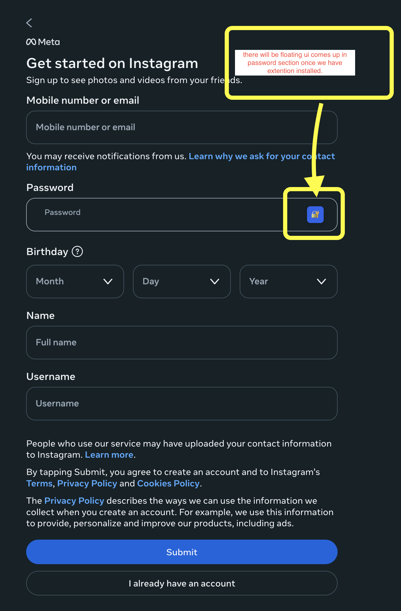
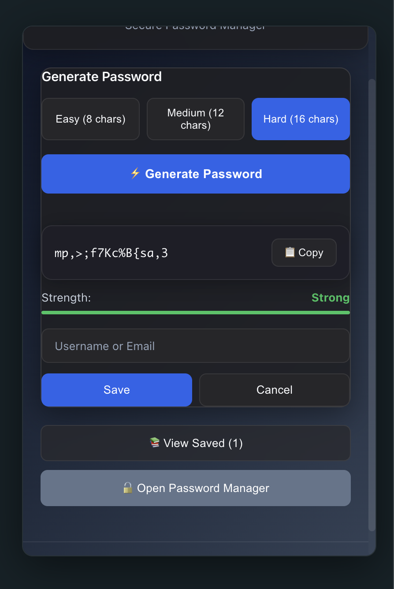
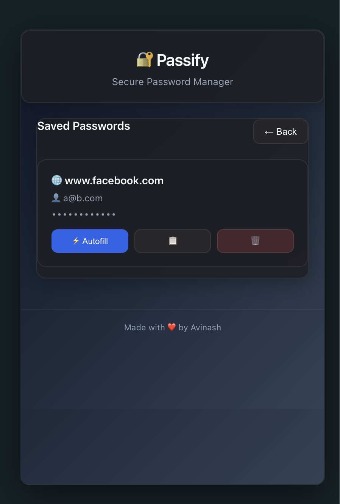
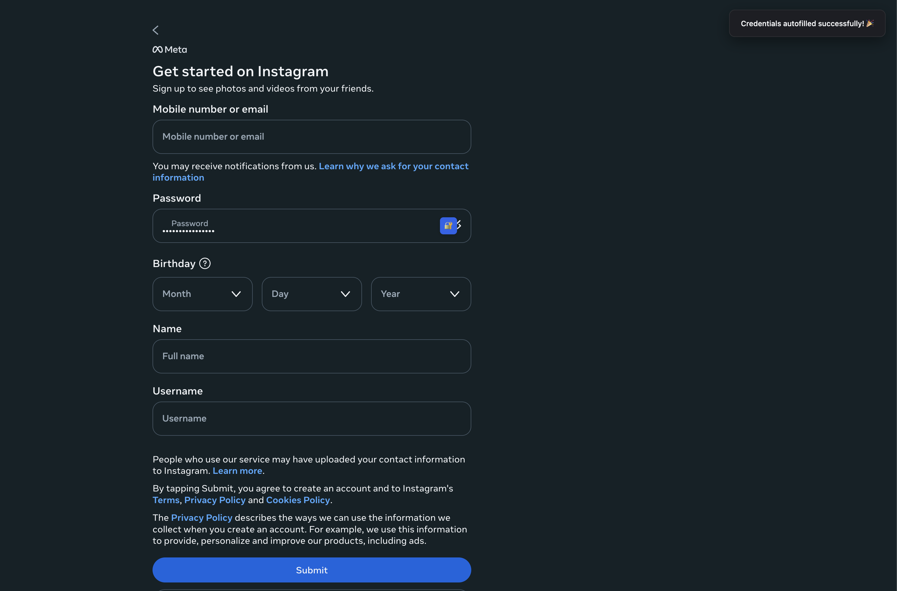

# 🔐 Passify - Privacy-First Password Manager

<div align="center">


**A secure, privacy-focused password manager browser extension**

[](LICENSE)
[](https://addons.mozilla.org/en-US/firefox/addon/passify-password-manager/)

[Features](#-features) • [Installation](#-installation) • [Usage](#-usage) • [Privacy](#-privacy) • [Development](#-development) • [Contributing](#-contributing)

</div>

---

## 📖 About

Passify is a modern password manager that prioritizes your privacy by keeping all data **locally on your device**. No cloud sync, no tracking, no data collection - just secure password management the way it should be.

### Why Passify?

- 🔒 **100% Local Storage** - Your passwords never leave your device
- 🚫 **No Cloud Sync** - Complete control over your data
- 🎯 **Privacy-First** - No tracking, analytics, or data collection
- 🎨 **Modern UI** - Professional dark theme with glassmorphism effects
- ⚡ **Fast & Lightweight** - Built with React and TypeScript
- 🌐 **Cross-Browser** - Works on Chrome, Firefox, and other Chromium browsers

---

## ✨ Features

### 🔑 Password Generator

Generate strong, secure passwords with customizable options.

<div align="center">
  
  <p><em>Password generator with 3 strength levels</em></p>
</div>

- **3 Strength Levels**: Easy, Medium, Hard
- **Customizable Length**: 8-32 characters
- **One-Click Copy**: Copy to clipboard instantly
- **Real-Time Strength Indicator**: Visual feedback on password strength
- **Secure Generation**: Uses cryptographic random number generation

---

### 💾 Password Manager

Manage all your passwords in one secure place.

<div align="center">
  
  <p><em>Full-page password manager interface</em></p>
</div>

- **Save Credentials**: Store username and password for any website
- **Full-Page Interface**: Dedicated password management page
- **Search & Filter**: Quickly find saved passwords
- **Edit & Delete**: Manage your credentials easily
- **Show/Hide Passwords**: Toggle password visibility
- **Auto-Popup**: Automatically suggests saved credentials on matching sites

---

### ⚡ Autofill

Automatically fill in your credentials with one click.

<div align="center">
  
  <p><em>One-click autofill on any website</em></p>
</div>

- **Smart Detection**: Automatically detects password fields
- **One-Click Fill**: Autofill with a single click
- **Secure Injection**: Safe credential insertion
- **Universal Support**: Works on all websites
- **Domain Matching**: Intelligent matching by website domain

---

### 💾 Save Passwords

Save your credentials securely when logging into websites.

<div align="center">
  
  <p><em>Save password dialog</em></p>
</div>

- **Automatic Detection**: Detects when you enter credentials
- **One-Click Save**: Save with a single click
- **Website Association**: Automatically links to current website
- **Secure Storage**: Encrypted local storage

### 🎨 Design
- **Modern Dark Theme**: Professional slate and blue color palette
- **Glassmorphism Effects**: Beautiful frosted glass UI elements
- **Responsive Layout**: Works perfectly at any size
- **Smooth Animations**: Polished user experience
- **Accessibility**: Keyboard navigation and screen reader support

---

## 📥 Installation

### From Browser Stores

#### Firefox
1. Visit [Firefox Add-ons](https://addons.mozilla.org/firefox/) (link coming soon)
2. Click "Add to Firefox"
3. Confirm installation


### Manual Installation (Development)

#### Chrome / Edge / Brave
1. Download the latest release or clone this repository
2. Run `npm install && npm run build`
3. Open `chrome://extensions/`
4. Enable "Developer mode"
5. Click "Load unpacked"
6. Select the `dist` folder

#### Firefox
1. Download the latest release or clone this repository
2. Run `npm install && npm run build`
3. Open `about:debugging#/runtime/this-firefox`
4. Click "Load Temporary Add-on"
5. Select `dist/manifest.json`

---

## 🚀 Usage

### Quick Start

1. **Generate a Password**
   - Click the Passify icon in your browser toolbar
   - Select password strength (Easy/Medium/Hard)
   - Adjust length if needed
   - Click "Generate Password"
   - Copy to clipboard

2. **Save Credentials**
   - Visit any website with a login form
   - Enter your credentials
   - Click the Passify button (🔐) next to the password field
   - Click "Save Password"
   - Credentials are saved locally

3. **Autofill**
   - Return to a saved website
   - Passify automatically detects saved credentials
   - Click the autofill button or select from the popup
   - Credentials are filled instantly

4. **Manage Passwords**
   - Click "Open Password Manager" in the popup
   - View all saved passwords
   - Search, edit, or delete entries
   - Export data (coming soon)

### Keyboard Shortcuts

- `Ctrl/Cmd + Shift + P` - Open Passify popup (coming soon)
- `Ctrl/Cmd + Shift + M` - Open Password Manager (coming soon)

---

## 🔒 Privacy & Security

### Our Privacy Promise

✅ **Local Storage Only** - All data stored in browser's local storage  
✅ **No Cloud Sync** - Your data never leaves your device  
✅ **No Tracking** - Zero analytics or telemetry  
✅ **No Data Collection** - We don't collect any user data  
✅ **No Network Requests** - Extension works completely offline  
✅ **Open Source** - Full transparency, audit the code yourself  

### Security Features

- **Secure Password Generation**: Uses `crypto.getRandomValues()` for cryptographic randomness
- **Local Encryption**: Data stored securely in browser storage
- **No External Dependencies**: All code runs locally
- **Content Security Policy**: Strict CSP to prevent XSS attacks
- **Safe DOM Manipulation**: No unsafe `innerHTML` usage

### Permissions Explained

| Permission | Why We Need It |
|------------|----------------|
| `storage` | Save your passwords locally in browser storage |
| `activeTab` | Detect password fields on the current page |
| `tabs` | Open password manager in a new tab |
| `<all_urls>` | Detect password fields on any website you visit |

**We only use these permissions for password management. No data is ever transmitted externally.**

---

## 🛠️ Development

### Prerequisites

- Node.js 22 or higher
- npm 10.9.2 or higher

### Setup

```bash
# Clone the repository
git clone https://github.com/jainavinash881/passify.git
cd passify

# Install dependencies
npm install

# Start development server
npm run dev

# Build for production
npm run build

# Build and package
npm run build && cd dist && zip -r ../passify.zip .
```

### Project Structure

```
passify/
├── src/
│   ├── background/       # Background script
│   ├── content/          # Content script (page injection)
│   ├── popup/            # Extension popup UI
│   ├── manager/          # Password manager page
│   ├── utils/            # Utility functions
│   ├── styles/           # Global styles
│   └── types/            # TypeScript definitions
├── public/
│   ├── manifest.json     # Extension manifest
│   └── icons/            # Extension icons
├── dist/                 # Build output (generated)
└── docs/                 # Documentation
```

### Tech Stack

- **Framework**: React 19.2.0
- **Language**: TypeScript 5.9.3
- **Build Tool**: Vite 7.3.0
- **Styling**: CSS with CSS Variables
- **Browser APIs**: Chrome Extension API / WebExtensions API

### Scripts

```bash
npm run dev        # Development mode with hot reload
npm run build      # Production build
npm run preview    # Preview production build
npm run lint       # Run ESLint
npm run type-check # TypeScript type checking
```

---

## 🤝 Contributing

We welcome contributions! Here's how you can help:

### Ways to Contribute

- 🐛 **Report Bugs**: Open an issue with details
- 💡 **Suggest Features**: Share your ideas
- 📝 **Improve Documentation**: Help others understand
- 🔧 **Submit Pull Requests**: Fix bugs or add features
- 🌍 **Translations**: Help translate Passify (coming soon)

### Development Workflow

1. Fork the repository
2. Create a feature branch (`git checkout -b feature/amazing-feature`)
3. Make your changes
4. Test thoroughly
5. Commit your changes (`git commit -m 'Add amazing feature'`)
6. Push to the branch (`git push origin feature/amazing-feature`)
7. Open a Pull Request

### Code Style

- Follow existing code style
- Use TypeScript for type safety
- Write meaningful commit messages
- Add comments for complex logic
- Test your changes in both Chrome and Firefox

---

## 📄 License

This project is licensed under the MIT License - see the [LICENSE](LICENSE) file for details.

---

## 📞 Support

- **Issues**: [GitHub Issues](https://github.com/jainavinash881/passify/issues)
- **Email**: jainavinash881@gmail.com
- **Discussions**: [GitHub Discussions](https://github.com/jainavinash881/passify/discussions)

---

## 📊 Stats


---

<div align="center">

**Made with 🔐 by [Avinash Jain](https://github.com/jainavinash881)**

If you find Passify useful, please consider giving it a ⭐ on GitHub!

[Report Bug](https://github.com/jainavinash881/passify/issues) • [Request Feature](https://github.com/jainavinash881/passify/issues) • [Documentation](https://github.com/jainavinash881/passify/wiki)

</div>
